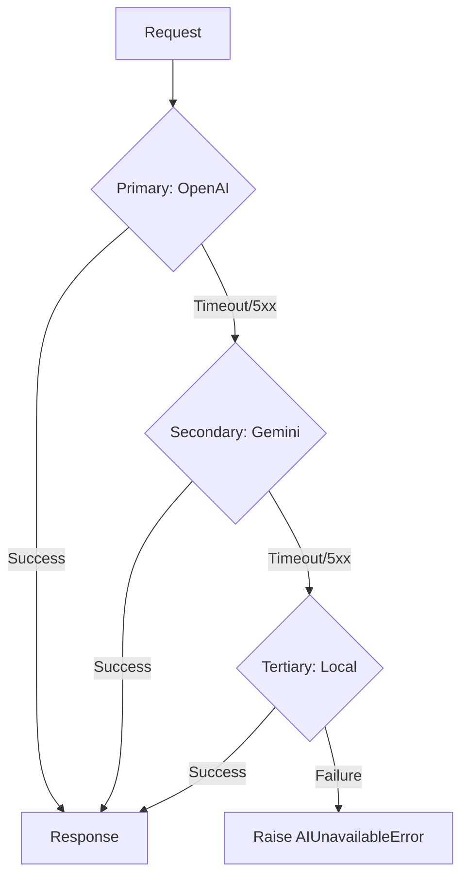

# AI Provider Configuration Guide

This guide details the integration, configuration, and management of Large Language Model (LLM) and Embedding providers within the Election Intelligence Platform.

## 1. LLMProvider Abstraction

The platform uses a unified `LLMProvider` interface located in `backend/app/ai/providers/base.py`. This ensures application logic remains decoupled from specific vendor implementations.

```python
from abc import ABC, abstractmethod
from typing import AsyncGenerator
from backend.app.ai.types import PromptRequest, LLMResponse

class LLMProvider(ABC):
    @abstractmethod
    async def generate(self, request: PromptRequest) -> LLMResponse:
        """Execute a standard prompt generation request."""
        pass

    @abstractmethod
    async def generate_stream(self, request: PromptRequest) -> AsyncGenerator[str, None]:
        """Stream generation results for real-time clients."""
        pass

    @abstractmethod
    async def get_token_count(self, text: str) -> int:
        """Calculate token usage for cost estimation and context window management."""
        pass
```

## 2. Supported Providers

### OpenAI (GPT-4o, GPT-4-Turbo)
The default provider for complex reasoning tasks. Managed via `OpenAIProvider`.
- **Primary Models**: `gpt-4o` (optimal speed/reasoning), `gpt-4-turbo` (fallback).
- **Client**: Uses `openai` async Python SDK.

### Google Gemini
Used for high-throughput or heavily multimodal extraction (e.g., PDF manifesto parsing). Managed via `GeminiProvider`.
- **Primary Models**: `gemini-1.5-pro` (analysis), `gemini-1.5-flash` (fast extraction).

### Local / Self-Hosted (vLLM / Ollama)
For air-gapped deployments or handling highly sensitive internal staging data. Managed via `LocalVLLMProvider` and `OllamaProvider`.
- **Compatible Models**: `Llama-3-70B-Instruct`, `Mistral-8x7B`.

## 3. Environment Variable Configuration

| Provider | Environment Variable | Description | Default |
|----------|----------------------|-------------|---------|
| **Core** | `ACTIVE_LLM_PROVIDER` | Selects the active provider instance. | `openai` |
| **OpenAI** | `OPENAI_API_KEY` | Authentication key for OpenAI. | - |
| **OpenAI** | `OPENAI_PRIMARY_MODEL` | The default OpenAI model to use. | `gpt-4o` |
| **Gemini** | `GEMINI_API_KEY` | Authentication key for Google AI. | - |
| **Gemini** | `GEMINI_PRIMARY_MODEL`| The default Gemini model to use. | `gemini-1.5-pro` |
| **Local** | `LOCAL_LLM_API_BASE` | URL for the local vLLM/Ollama server. | `http://localhost:8000/v1` |
| **Local** | `LOCAL_LLM_MODEL` | Model identifier on the local server. | `llama-3-8b` |

## 4. Switching Providers

Provider switching requires **no code changes**. Modify the environment configuration in your deployment manifests or `.env` file and restart the API containers.

```bash
# Switch from OpenAI to local vLLM
export ACTIVE_LLM_PROVIDER="local"
export LOCAL_LLM_API_BASE="http://vllm-service.production.svc.cluster.local:8000/v1"
```
The `backend/app/ai/providers/factory.py` reads `ACTIVE_LLM_PROVIDER` at startup and injects the corresponding implementation into the dependency container.

## 5. Adding a New LLM Provider

1. **Implement Interface**: Create a new class in `backend/app/ai/providers/` inheriting from `LLMProvider`.
2. **Handle Errors**: Map vendor-specific exceptions to the platform's `AIProviderError`.
3. **Register Factory**: Add the new provider identifier to `ProviderFactory.create_provider()`.
4. **Test**: Add a mock integration test in `tests/ai/providers/test_new_provider.py`.

## 6. Embedding Model Configuration

Embeddings run via a separate interface (`EmbeddingProvider`). 

- **OpenAI**: `text-embedding-3-small` (default) or `text-embedding-3-large`.
- **Local**: `BAAI/bge-m3` (multilingual support crucial for Indian languages).

Configure via:
```env
EMBEDDING_PROVIDER="openai" # or "local"
EMBEDDING_MODEL="text-embedding-3-small"
EMBEDDING_DIMENSIONS=1536
```

## 7. Token Limits and Chunking Strategy

Documents are processed using `backend/app/ai/vector/chunking.py`.
- **OpenAI / Gemini**: Maximum target chunk size is `1024` tokens with `128` token overlap.
- **Local Models**: Maximum target chunk size is `512` tokens with `64` token overlap to respect smaller context windows (e.g., 8k limits).
Context assembly (`backend/app/ai/retrieval/`) enforces a hard limit of `30,000` tokens per RAG request to ensure reasoning remains sharp and costs stay controlled.

## 8. Cost Considerations and Caching

To optimize token usage:
1. **Semantic Cache**: Integrated in `backend/app/core/cache/` using Redis. Identical queries hit the cache before triggering an LLM call.
2. **Token Budgets**: Enforced via `backend/app/performance/ratelimit/`. Exceeding limits triggers HTTP 429.
3. **Tracking**: Every `LLMResponse` object logs `prompt_tokens` and `completion_tokens` directly to DataDog via `backend/app/observability/metrics/`.

## 9. Fallback Strategy

The application leverages a `CircuitBreaker` and Fallback chain in `backend/app/ai/providers/fallback.py`.



## 10. Provider Testing

To verify provider connectivity and configuration, run the diagnostic CLI tool:

```bash
# Validates API keys, performs a basic generation, and checks latency
python -m backend.app.ai.diagnostics --provider openai --check-embeddings
```
Integration endpoints (`GET /api/v1/health/ai`) provide real-time status of the active provider in the readiness probe.
