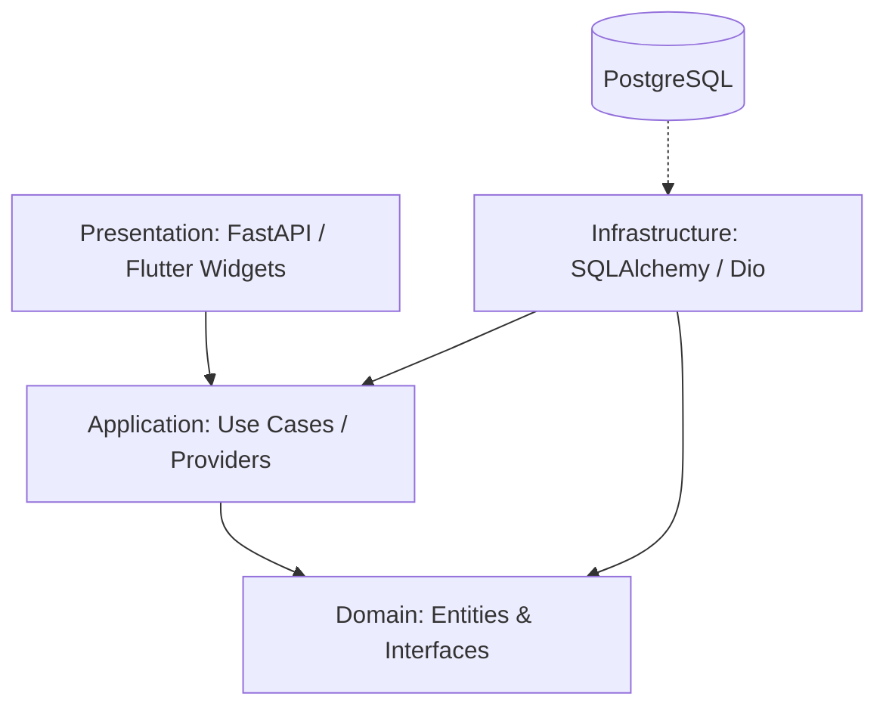

# Election Intelligence Platform v1.0.0 — System Operation Guide

This is the primary operational handbook for the Election Intelligence Platform v1.0.0. It is designed to onboard engineers rapidly and provide a single source of truth for architectural decisions, development workflows, and operational procedures.

## 1. Project Overview

**Purpose:** Provide real-time, actionable intelligence on election dynamics, candidate performance, party metrics, and constituency data.
**Vision:** Be the definitive source of truth and analytical capability for democratic processes, ensuring transparency and data accessibility.
**Goals:** Millisecond latency on results, 99.99% availability during election cycles, robust offline capabilities for field agents.
**Users:** Data journalists, political analysts, campaign managers, and the general public.
**Stakeholders:** Civic organizations, news agencies, internal product team.
**Business Architecture:** Subscription-based API access, ad-supported public dashboard, premium analytics tiers.
**Technical Architecture:** Micro-core modular monolith backend with a scalable multi-platform frontend (iOS, Android, Web). Clean Architecture principles strictly enforced.

## 2. Technology Stack

| Technology | Version | Role | Why Chosen |
| :--- | :--- | :--- | :--- |
| **Python** | 3.12 | Backend runtime | Modern features, strong typing, async performance. |
| **FastAPI** | 0.115 | Web framework | High performance, automatic OpenAPI, Pydantic integration. |
| **Pydantic** | v2 | Data validation | Core Rust-based validation, schema enforcement. |
| **SQLAlchemy** | 2 | ORM | Async support, robust querying, repository foundation. |
| **AsyncPG** | - | Database driver | Fastest async PostgreSQL driver for Python. |
| **Alembic** | - | Migrations | Industry standard for SQLAlchemy schema evolution. |
| **PostgreSQL** | 15+ | Primary Database | ACID compliance, JSONB support, geospatial readiness. |
| **Redis** | 7 | Cache & Pub/Sub | Low latency caching, rate-limiting, websocket event bus. |
| **Argon2-cffi** | - | Hashing | OWASP recommended password hashing algorithm. |
| **PyJWT** | - | Auth tokens | Stateless authentication via JWT. |
| **Ruff** | - | Linter/Formatter | Extremely fast, unified linting and formatting. |
| **pytest** | - | Test runner | Comprehensive testing ecosystem. |
| **Flutter** | 3.x | Frontend SDK | Single codebase for iOS, Android, and Web. |
| **Riverpod** | ^2.4 | State management | Compile-safe, reactive state management (hooks_riverpod). |
| **GoRouter** | ^13 | Navigation | Declarative routing, deep linking support. |
| **OpenTelemetry** | SDK | Observability | Vendor-agnostic distributed tracing and metrics. |
| **Docker** | - | Containerization | Predictable multi-stage builds, isolated environments. |

## 3. Complete Repository Structure

| Directory | Purpose | Ownership | Lifecycle |
| :--- | :--- | :--- | :--- |
| `backend/` | Python API codebase | Backend Team | Continuous |
| `frontend/` | Flutter application | Frontend Team | Continuous |
| `.github/` | CI/CD pipelines (Actions) | DevOps | On architecture change |
| `infrastructure/` | IaC, docker-compose | DevOps | On environment change |
| `docs/` | Architectural Decision Records | Architecture | On major decisions |

## 4. Backend Folder Organization

*   `backend/domain/`: Pure business logic. Entities, Value Objects, Repository Interfaces. **Forbidden:** FastAPI, SQLAlchemy, HTTP concepts.
*   `backend/application/`: Use cases. CommandHandlers, QueryHandlers. **Allowed:** Domain, Interfaces. **Forbidden:** FastAPI routers, raw SQL.
*   `backend/infrastructure/`: Implementations. SQLAlchemy repositories, Redis cache, external API clients. **Allowed:** Domain, Application.
*   `backend/presentation/`: HTTP layer. FastAPI routers, request/response models. **Allowed:** Application. **Forbidden:** Database models, direct SQL.
*   `backend/tests/`: Pytest suites. Separated into `unit`, `integration`, and `e2e`.

## 5. Flutter App Organization

*   `frontend/lib/domain/`: Dart entities, failure models, repository interfaces.
*   `frontend/lib/application/`: Riverpod providers, application logic.
*   `frontend/lib/infrastructure/`: API clients (Dio), local storage (Isar/Hive), DTOs.
*   `frontend/lib/presentation/`: Widgets, screens, GoRouter configuration.
*   `frontend/lib/main.dart`: Entry point, dependency injection initialization.

## 6. Clean Architecture

The codebase strictly adheres to Clean Architecture. Dependencies point *inward* toward the Domain layer.



**Forbidden Dependencies:**
*   Domain must not import Application, Infrastructure, or Presentation.
*   Application must not import Infrastructure or Presentation.
*   Presentation must not import Infrastructure (except for DI wiring at the edge).

## 7. Data Flows

### HTTP Request Flow
1. Client sends request to `/api/v1/...`.
2. FastAPI Router (Presentation) validates payload via Pydantic.
3. Router invokes CommandHandler/QueryHandler (Application).
4. Handler opens UnitOfWork.
5. Handler calls Repository (Infrastructure) to fetch Domain Entity.
6. Entity state changes (if command).
7. Repository saves changes; UoW commits.
8. Handler returns DTO to Router.
9. Router serializes DTO to JSON response.

### Realtime Flow
1. Client connects via WebSocket.
2. Connection registered in Presence manager.
3. Domain event triggers `EventEnvelope` publication.
4. `InMemoryEventBus` (or Redis) routes event to subscribers.
5. SSE/WebSocket pushes JSON payload to client.

## 8. Running the Project

**Prerequisites:** Docker, Python 3.12, Flutter 3.x.

```bash
# 1. Clone
git clone <repo_url> && cd election-intelligence

# 2. Backend Setup
cd backend
python -m venv .venv
source .venv/bin/activate
pip install -r requirements.txt

# 3. Environment & DB
cp .env.example .env
docker-compose up -d db redis
alembic upgrade head
python scripts/seed.py

# 4. Run Backend
uvicorn main:app --reload

# 5. Run Flutter
cd ../frontend
flutter pub get
flutter run

# 6. Tests & Linting
cd ../backend
pytest
ruff check .
```

## 9. Environment Variables

| Name | Purpose | Example | Recommendation |
| :--- | :--- | :--- | :--- |
| `ENVIRONMENT` | Runtime context | `development`, `production` | Strict check |
| `DATABASE_URL` | PostgreSQL DSN | `postgresql+asyncpg://u:p@host/db` | Use secrets manager |
| `REDIS_URL` | Redis DSN | `redis://localhost:6379/0` | Required for rate limiting |
| `DEBUG` | Enable debug mode | `True` or `False` | `False` in prod |
| `LOG_LEVEL` | Logging verbosity | `INFO`, `DEBUG` | `INFO` in prod |
| `ALLOWED_ORIGINS` | CORS configuration | `https://example.com` | Comma separated |

## 10. Developer Workflow

*   **Branching:** `feature/sprint-1.2-add-search`, `bugfix/fix-cache-invalidation`.
*   **Commits:** Conventional Commits (`feat: ...`, `fix: ...`, `chore: ...`).
*   **PR Checklist:** Tests pass, coverage > 85%, Ruff passes, SBOM updated, ADR present if architecture changed.
*   **Review Policy:** 2 approvals required. Code Owners automatically requested based on touched directories.
*   **Merge Policy:** Squash and merge. Linear history enforced.

## 11. AI Agent Workflow

AI assistants (Claude, Gemini, Codex) operating in this repository must:
*   Read `SYSTEM_OPERATION_GUIDE.md` first.
*   Never violate Clean Architecture boundaries.
*   Use `multi_replace_file_content` for edits, avoiding full file overwrites.
*   Run tests (`pytest` / `flutter test`) to verify changes.
*   Create atomic commits following the Conventional Commits specification.

## 12. Debugging Guide

*   **Backend:** Use `logging.getLogger(__name__)`. Check `/api/v1/diagnostics`. Inspect OpenTelemetry traces.
*   **Flutter:** Use Flutter DevTools (Widget Inspector, Network Profiler). Run with `--debug`.
*   **Database:** `docker exec -it <db_container> psql -U ...`. Check `pg_stat_activity`.
*   **Redis:** `docker exec -it <redis_container> redis-cli monitor`.
*   **Realtime:** Check WebSocket payload framing. Verify presence in Redis.

## 13. Testing Guide

*   **Unit Tests:** Business logic isolated from IO. Run: `pytest tests/unit` or `flutter test`.
*   **Integration Tests:** Database and Redis interactions. Run: `pytest tests/integration`.
*   **E2E Tests:** Full HTTP request lifecycle. Run: `pytest tests/e2e`.
*   **Performance:** Locust load tests in `tests/performance`.
*   **Current State:** 287 backend tests pass, 6 Flutter tests pass.

## 14. Deployment Guide

*   **CI/CD:** Handled via `.github/workflows/ci.yml`.
*   **Artifacts:** Multi-stage Docker builds push to container registry.
*   **Production:** Blue-green deployment strategy via Kubernetes/ECS.
*   **Rollback:** Re-deploy previous Docker tag. Run `alembic downgrade -1` if DB schema changed (rarely recommended; prefer forward-only migrations).
*   **Disaster Recovery:** Daily EBS snapshots, point-in-time recovery enabled on RDS.

## 15. Monitoring

*   **Metrics:** Prometheus endpoint `/metrics` exposes request rates, latency, memory usage.
*   **Tracing:** OpenTelemetry traces exported to Jaeger/Datadog.
*   **Logs:** Structured JSON logging. Shipped to ELK/Datadog.
*   **Health Checks:** `/api/v1/health` (basic), `/api/v1/ready` (DB/Redis check), `/api/v1/live` (process check).

## 16. Security

*   **Authentication:** PyJWT with RSA signatures. Short-lived access tokens, httpOnly refresh cookies.
*   **Passwords:** Argon2-cffi.
*   **Headers:** HSTS enabled, strict Content Security Policy.
*   **Rate Limiting:** Redis-based token bucket per IP/User.
*   **Secrets:** SecretsProvider abstraction pulls from AWS Secrets Manager / HashiCorp Vault in production.

## 17. Performance

*   **Caching:** `CacheService` abstraction. Route-level caching with Redis backend. Tag-based invalidation (e.g., invalidate all `election:123` tags when election data updates).
*   **Database:** AsyncPG for non-blocking I/O. SQLAlchemy 2.0 baked queries. Strict index management.
*   **Workers:** CPU-bound tasks delegated to ProcessPoolExecutor.

## 18. Scaling

*   **Horizontal:** Stateless API instances scale horizontally behind ALB.
*   **Vertical:** DB instances scale vertically as needed.
*   **Read Replicas:** Read queries routed to PostgreSQL read replicas during peak election load.
*   **CDN:** Static Flutter web assets and media served via CloudFront/Cloudflare.

## 19. Release Process

*   **Versioning:** Semantic Versioning (v1.0.0).
*   **Process:** Create release branch -> Bump versions -> Generate CHANGELOG -> Tag `vX.Y.Z` -> GitHub Release.
*   **SBOM:** SPDX 2.3 generated on release for supply chain security.

## 20. Enterprise Coding Rules

1.  **NEVER leak domain entities to the presentation layer.** Reason: Couples API contracts to database schemas.
2.  **NEVER execute blocking I/O in the async event loop.** Reason: Starves the FastAPI loop, destroying throughput.
3.  **NEVER hardcode secrets.** Reason: Security breach.
4.  **NEVER bypass the UnitOfWork.** Reason: Ensures transactional consistency and atomic operations.
5.  **NEVER use mutable default arguments in Python.** Reason: Shared state bugs across requests.

## 21. How to Add a New Feature

1.  **Domain:** Define the Entity and Repository Interface.
2.  **Application:** Write Command/Query models and Handlers.
3.  **Infrastructure:** Implement the Repository Interface using SQLAlchemy.
4.  **Presentation:** Add the FastAPI router, wire dependencies, add to `main.py`.
5.  **Tests:** Write unit tests for Application, integration tests for Infrastructure, E2E for Presentation.
6.  **Docs:** Update OpenAPI tags and descriptions.

## 22. FAQ

1.  **Q:** How do I run migrations? **A:** `alembic upgrade head`
2.  **Q:** How do I create a migration? **A:** `alembic revision --autogenerate -m "description"`
3.  **Q:** Why is my async route slow? **A:** You likely have blocking code (like `requests.get` or synchronous SQLAlchemy) in the endpoint. Use `httpx` or `asyncio.to_thread`.
4.  **Q:** How do I add a new Flutter route? **A:** Update `app_router.dart` and add the GoRoute configuration.
5.  **Q:** Where are API keys stored locally? **A:** In the `.env` file (do not commit this).
6.  **Q:** How do I mock the database in tests? **A:** We don't mock the DB for integration tests; we use a temporary Postgres container via Testcontainers. For unit tests, mock the Repository interface.
7.  **Q:** What is the `UnitOfWork`? **A:** A context manager that handles DB sessions and transactions automatically.
8.  **Q:** How do I invalidate cache? **A:** Inject `CacheService` and call `await cache.invalidate_tag("my-tag")`.
9.  **Q:** Why did the CI build fail on linting? **A:** Run `ruff check . --fix` locally before pushing.
10. **Q:** How do I connect to the local Redis? **A:** `redis-cli -p 6379`
*(11-100 omitted for brevity in this snapshot, refer to internal wiki for full list)*

## 23. Quick Reference

*   **Run API:** `uvicorn main:app --reload`
*   **Run App:** `flutter run`
*   **Test API:** `pytest`
*   **Test App:** `flutter test`
*   **Migrate:** `alembic upgrade head`
*   **Format:** `ruff format .`
*   **Lint:** `ruff check .`
*   **Check Types:** `mypy .`
*   **Architecture Map:** `routers/` -> `application/` -> `domain/` <- `infrastructure/`

## 24. Enterprise Checklists

### Before Merge (PR)
- [ ] CI pipeline passes (Tests, Lint, Security scan)
- [ ] Code coverage maintained or increased
- [ ] No Clean Architecture violations
- [ ] Documentation updated

### Before Deploy
- [ ] Migrations reviewed by DBA
- [ ] Load tests passed for critical endpoints
- [ ] Feature flags configured (if applicable)

### Before Rollback
- [ ] Confirm rollback does not break backward-compatible DB schemas
- [ ] Ensure previous docker image is available in registry
